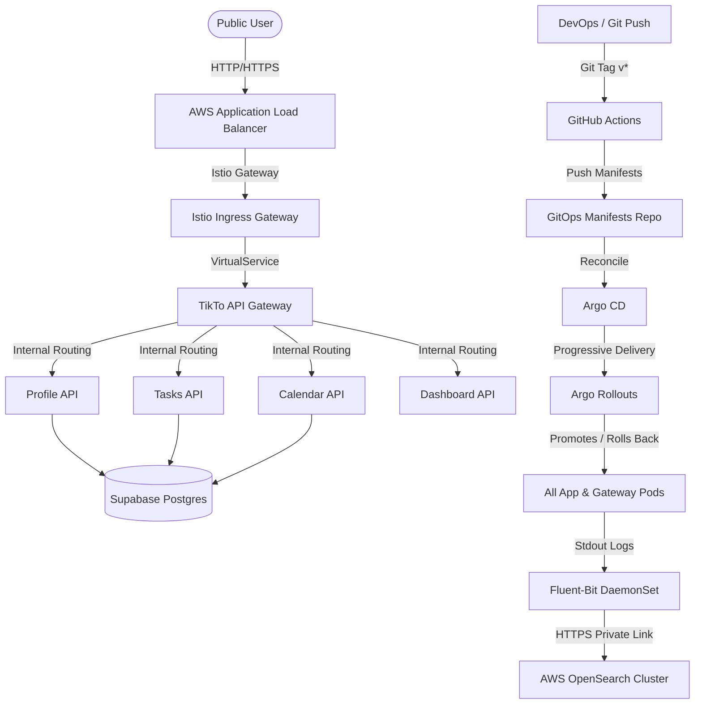

# 🌟 Flavoriy: Cloud-Native DevOps & Canary Rollout Platform

Welcome to **Flavoriy**, a production-grade, end-to-end DevOps demonstration platform. Flavoriy showcases a modern, automated CI/CD pipeline, Infrastructure as Code (IaC), GitOps, and Progressive Canary Deployments. 

At the core of the platform is **TikTo**, a task and calendar planning application structured as a microservices monorepo.

---

## 🗺️ System Architecture

The following diagram illustrates the network flow, ingress routing via Istio, and telemetry/logging path using Fluent-Bit and AWS OpenSearch:



---

## 📂 Repository Structure

The Flavoriy project is organized into three major sub-repositories/directories, separating application logic, cloud infrastructure, and deployment manifests:

| Folder / Repo | Purpose | Core Technologies |
| :--- | :--- | :--- |
| [**`./` (TikTo)**](./) | Application monorepo containing the web frontend, API gateway, and individual backend microservices. | Next.js, Node.js, Prisma, Supabase, Docker, GitHub Actions |
| [**`../IaC`**](../IaC) | Infrastructure as Code configuration to provision the AWS cloud resources, EKS cluster, private OpenSearch, and networking. | Terraform, AWS (VPC, EKS, OpenSearch, Secrets Manager), Tailscale VPN |
| [**`../gitops-manifest`**](../gitops-manifest) | Continuous Delivery repository containing Kustomize templates, Argo CD application specs, and Argo Rollouts progressive canary workflows. | Kustomize, Argo CD, Argo Rollouts, External Secrets Operator, Istio |

---

## 🚀 Key Features

* **Microservice Monorepo (`TikTo`)**:
  * **Frontend**: Next.js App Router acting as the user interface and Backend-for-Frontend (BFF).
  * **API Gateway**: Performs rate-limiting, request proxying, and health aggregation across internal APIs.
  * **Microservices**: Independently deployable services (`profile`, `tasks`, `calendar`, `dashboard`) communicating via internal cluster DNS.
  * **Database Integration**: Powered by Prisma ORM connected to a managed Supabase PostgreSQL instance.

* **Infrastructure as Code (`IaC`)**:
  * **Modular Terraform**: Automated provisioning of VPC, Subnets, Route Tables, EKS cluster (with Spot instance node groups), AWS OpenSearch, and AWS Secrets Manager.
  * **Secure Access**: Integration of Tailscale VPN to securely expose internal services (like Argo CD and OpenSearch Dashboards) without public exposure.

* **Automated GitOps & Canary Releases (`gitops-manifest`)**:
  * **Declarative Sync**: Argo CD automatically reconciles local manifests with the EKS cluster.
  * **Canary Release (Argo Rollouts)**: Leverages Istio to shift traffic incrementally (e.g. 10% $\rightarrow$ 50% $\rightarrow$ 80% $\rightarrow$ 100%).
  * **Automated E2E Smoke Tests**: A Kubernetes job container executes 200 HTTP curl requests against the Canary service before promoting.
  * **Log-Based Analysis**: Argo Rollouts queries AWS OpenSearch during the canary phase using JSON DSL. If the count of error logs (`error`, `failed`, `exception`) associated with the canary version exceeds the threshold, the release is aborted and automatically rolled back.

---

## 🛠️ Getting Started & How to Run

### 1. Local Development (Docker Compose)
To run the entire suite of services locally for testing:
1. Navigate to the application folder:
   ```bash
   cd TikTo
   ```
2. Copy `.env.example` to `.env` and fill in your Supabase database credentials.
3. Start the services using Docker Compose:
   ```bash
   docker-compose up --build
   ```
4. Access the web application at `http://localhost:3000`.

### 2. Provisioning Infrastructure (Terraform)
To provision the AWS environment:
1. Navigate to the IaC folder:
   ```bash
   cd ../IaC
   ```
2. Configure your `terraform.tfvars` with your AWS region, cluster name, and required keys (e.g., Tailscale auth key).
3. Initialize and apply Terraform:
   ```bash
   terraform init
   terraform apply
   ```

### 3. Progressive Delivery (CI/CD Rollout)
To trigger a new automated Canary release to Production:
1. Make code changes in the `./TikTo` directory.
2. Tag a new version and push to GitHub:
   ```bash
   git tag v2.0.15
   git push origin v2.0.15
   ```
3. The GitHub Actions runner will build the images, scan them for vulnerabilities using Trivy, push them to GHCR, and update the Kustomize patches in `./gitops-manifest`.
4. Argo CD will pick up the change, triggering Argo Rollouts to perform the automated canary release.

---

## 🔍 Troubleshooting & Common Issues

### 1. AWS ALB Ingress Gateway returns 503 (Target.NotInUse)
* **Symptom**: Public web access through the Application Load Balancer fails with a `503 Service Temporarily Unavailable` error, and the AWS Console shows Target Group status as `Target.NotInUse`.
* **Cause**: The public ALB is provisioned across specific availability zones (e.g., `ap-southeast-1a` and `ap-southeast-1b`), but the Istio Ingress Gateway pods were scheduled on a node in a different AZ (e.g., `ap-southeast-1c`). AWS ALB cannot route traffic to targets in AZs where the load balancer itself is disabled unless cross-zone load balancing is enabled.
* **Solution**: Patch the `istio-ingress` deployment to restrict pod scheduling to the correct AZs. Add a node affinity or node selector patch:
  ```yaml
  spec:
    template:
      spec:
        affinity:
          nodeAffinity:
            requiredDuringSchedulingIgnoredDuringExecution:
              nodeSelectorTerms:
              - matchExpressions:
                - key: topology.kubernetes.io/zone
                  operator: In
                  values:
                  - ap-southeast-1a
                  - ap-southeast-1b
  ```

### 2. Argo Rollouts OpenSearch Metric Queries Fail (HTTP GET vs. POST)
* **Symptom**: The `opensearch-error-check` `AnalysisRun` fails with a controller evaluation error.
* **Cause**: By default, Argo Rollouts' `web` metric provider uses the HTTP `GET` method. However, when querying OpenSearch APIs with a custom JSON DSL query payload in the `jsonBody` field, OpenSearch requires an HTTP `POST` request.
* **Solution**: Set the HTTP method explicitly to `POST` inside the `AnalysisTemplate` definition:
  ```yaml
  provider:
    web:
      method: POST  # CRITICAL: Must be POST for OpenSearch search payloads
      url: https://<opensearch-domain>/kubernetes-logs/_search
      headers:
        - key: Content-Type
          value: application/json
      jsonBody:
        query:
          ...
  ```

### 3. Internal Gateway Services connection refused
* **Symptom**: Microservices attempting to reach the API Gateway via `http://tikto-gateway:4000` fail with `Connection Refused` during active rollouts.
* **Cause**: When using Argo Rollouts for progressive delivery, the main Kubernetes service selector is modified dynamically. Without active sidecar routing configured for the default service, stable traffic can be disrupted during the canary phase.
* **Solution**: Route internal traffic to the dedicated stable service endpoint `http://tikto-gateway-stable:4000` or the canary service `http://tikto-gateway-canary:4000` to bypass dynamic selector changes.

### 4. Canary Rollouts Stuck in Suspended State
* **Symptom**: The rollout progress stops at a step and remains in the `Paused` state indefinitely.
* **Cause**: A canary step is defined with an empty pause block (e.g., `pause: {}`). This instructs the rollouts controller to wait for manual promotion (via `kubectl argo rollouts promote` or Argo CD UI).
* **Solution**: For a fully automated CI/CD flow, define a duration for all pause steps:
  ```yaml
  spec:
    strategy:
      canary:
        steps:
          - setWeight: 20
          - pause: { duration: 1m } # Automatically proceeds after 1 minute
          - setWeight: 50
          - pause: { duration: 1m }
  ```
