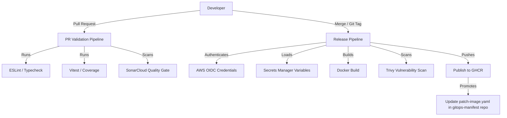

# TikTo
TikTo is a task & calendar planning application, structured as a monorepo with one web frontend and five internal microservices backend.
---

## Architecture & Services

| Service | Role |
|---|---|
| `apps/web` | Next.js 16 (App Router) — UI + Backend-for-Frontend (BFF) proxy |
| `services/gateway` | API Gateway (Express) — rate-limiting, internal route proxying, health aggregation |
| `services/profile` | Profile domain service (Prisma + Supabase Postgres) |
| `services/tasks` | Task management domain service (Prisma + Supabase Postgres) |
| `services/calendar` | Calendar event domain service (Prisma + Supabase Postgres) |
| `services/dashboard` | Composition service — aggregates data from profile/tasks/calendar |

---

## CI/CD Workflow



### 1. PR Validation
*   **Trigger/Tasks:** Every PR triggers parallel `lint`, `typecheck`, `Vitest` (with coverage), and SonarCloud analysis.
*   **Goal:** Fast dev feedback; **no artifacts are built**.

### 2. Matrix Build & Security
*   **Parallel Build:** GitHub Actions matrix builds 6 services (`web`, `gateway`, etc.) concurrently.
*   **Speed Optimization:** Uses *path filtering* (only builds changed services) and *shared base Dockerfiles* (skips reinstalling `node_modules`).
*   **Security & Push:** Runs parallel Trivy scans (HIGH/CRITICAL). Successful builds push immutable images to GHCR tagged with short Git SHAs (e.g., `web:sha-a1b2c3d`).

### 3. GitOps Automation (Dev & Prod)
*   **Dev Deploy (Auto):** Pipeline updates `overlays/dev/patch-image.yaml` with the Git SHA. Argo CD automatically syncs to `tikto-dev` (K3s) with zero approval gates.
*   **Prod Promotion (Manual):** Triggered by cutting a Git tag (e.g., `v2.0.15`). **No rebuilds**—re-tags the exact dev image digest to guarantee byte-for-byte consistency.
*   **Prod Deploy:** Pipeline commits the tag to `overlays/prod/patch-image.yaml`. Argo CD syncs to `tikto-prod` (EKS), and Argo Rollouts manages the canary deployment.

---

## 🛠️ Local Development

### Install dependencies

```bash
npm install
```

### Build internal microservices & generate Prisma client

```bash
npm run services:build
```

### Run the dev server

```bash
npm run dev                              # Next.js Web
npm run service:gateway:start            # API Gateway
npm run service:profile:start            # Profile Service
npm run service:tasks:start              # Tasks Service
npm run service:calendar:start           # Calendar Service
npm run service:dashboard:start          # Dashboard Service
```
---

## 🧱 Tech stack

`Next.js 16` `TypeScript` `Express` `Prisma` `Supabase Postgres` `Vitest` `SonarCloud` `Docker` `Trivy` `GHCR` `GitHub Actions`
