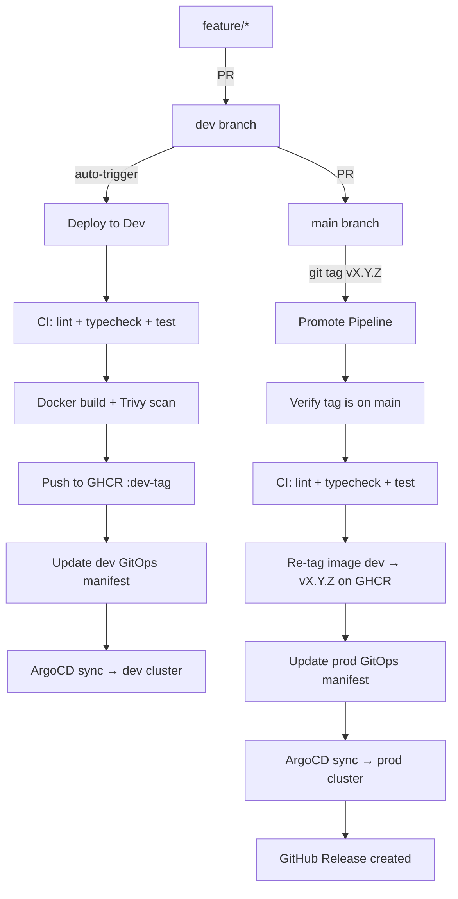

# 📱 TikTo Application

TikTo is a task and calendar planning application structured as a monorepo containing a public web frontend/BFF and five internal microservices.

## 🏗️ Architecture & Service Layout

| Service | Description |
|---|---|
| `apps/web` | Next.js 16 (App Router) — user interface and Backend-for-Frontend (BFF) proxy |
| `services/gateway` | Express-based API Gateway — rate-limiting, internal route proxying, health aggregation |
| `services/profile` | Profile domain service (Prisma + Supabase Postgres) |
| `services/tasks` | Task management service (Prisma + Supabase Postgres) |
| `services/calendar` | Calendar event service (Prisma + Supabase Postgres) |
| `services/dashboard` | Composition service — aggregates data from profile, tasks, and calendar |

---

## 🔄 CI/CD Workflow

### Branching Strategy

```
feature/* ──► PR ──► dev  ──────────────────────► auto deploy dev
                     │
                     ▼
             PR ──► main ──► git tag vX.Y.Z ──► promote prod
```

| Branch | Purpose | Deploy |
|---|---|---|
| `feature/*` | Development work | — |
| `dev` | Integration / staging | Auto-deploy to **dev** env on merge |
| `main` | Production-ready code | Promote to **prod** via git tag |

### Pipeline Overview



### 1. PR Validation (`pr-checks.yml`)
Every pull request triggers:
- **Linting & Typechecking**: `npm run lint` & `npm run typecheck`
- **Unit Testing**: Vitest with coverage reports
- **Code Quality**: SonarCloud Quality Gate analysis

### 2. Deploy to Dev (`deploy-dev.yml`)
On every merge to `dev`:
- CI checks (lint, typecheck, test)
- Docker build with optimized **Base Dockerfile** layer caching
- Trivy vulnerability scan (HIGH & CRITICAL)
- Push image to GHCR with tag `dev-<run>-<sha>`
- Update `gitops-manifest` → ArgoCD deploys to **dev** cluster

### 3. Promote to Prod (`promote.yml`)
Triggered by pushing a tag matching `v*` (e.g. `v3.0.8`):

> ⚠️ **Tag must be created from a commit on `main`** — the pipeline enforces this with a guard job. Tagging from `dev` or any other branch will fail immediately.

- **Guard**: Verify tag commit is on `main` branch
- **CI**: Full lint + typecheck + test suite
- **Re-tag**: Copy image from dev tag → semver tag on GHCR (no rebuild)
- **GitOps**: Update prod `patch-image.yaml`
- **Release**: Auto-generate GitHub Release with changelog

#### How to release to prod
```bash
# 1. Merge dev → main via PR on GitHub

# 2. Pull latest main
git checkout main
git pull origin main

# 3. Create and push tag
git tag v3.0.8
git push origin v3.0.8
```

---

## 🛠️ Local Development

### Prerequisites
- Node.js 22 (use `.nvmrc` with `nvm use`)
- Docker (for running services locally)

### Setup
```bash
# Install dependencies
npm install

# Build microservices & generate Prisma client
npm run services:build
```

### Running Services
```bash
# Next.js web frontend
npm run dev

# Individual backend services
npm run service:gateway:start
npm run service:profile:start
npm run service:tasks:start
npm run service:calendar:start
npm run service:dashboard:start
```

### Running with Docker Compose
```bash
docker-compose up --build
```

### Useful Scripts
```bash
npm run lint           # ESLint
npm run typecheck      # TypeScript check
npm run test           # Vitest (watch)
npm run test:run       # Vitest (single run)
npm run test:coverage  # Vitest with coverage
```

---

## 🔍 Troubleshooting

### ❌ `estree-walker` 404 on npm install
- **Cause**: `vitest@4.1.6` and `ast-v8-to-istanbul@1.0.0` depend on `estree-walker@3.0.4` which was unpublished from npm.
- **Fix**: `vitest` is pinned to `4.1.5` and `ast-v8-to-istanbul` is overridden to `^1.0.5` in `package.json`.

### ❌ Connection Refused on Internal Gateway Calls
- **Cause**: Argo Rollouts dynamically updates the selector for the `tikto-gateway` service during canary rollout. Pods cannot resolve the shifting backend endpoint.
- **Fix**: Use the stable endpoint instead:
  ```env
  TIKTO_GATEWAY_API_URL=http://tikto-gateway-stable:4000
  ```
