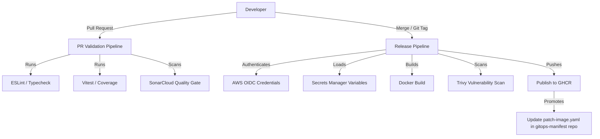

# TikTo
TikTo is a task & calendar planning application, structured as a monorepo with one web frontend and five internal microservices backend.
---

## Architecture & Services

| Service | Role |
|---|---|
| `apps/web` | Next.js 16 (App Router) — UI + Backend-for-Frontend (BFF) proxy |
| `services/gateway` | API Gateway (Express) — rate-limiting, internal route proxying, health aggregation |
| `services/profile` | Profile domain service (Prisma + Supabase Postgres) |
| `services/tasks` | Task management domain service (Prisma + Supabase Postgres) |
| `services/calendar` | Calendar event domain service (Prisma + Supabase Postgres) |
| `services/dashboard` | Composition service — aggregates data from profile/tasks/calendar |

---

## CI/CD Workflow



1. PR Validation

Every pull request triggers:
Linting & Typechecking: npm run lint & npm run typecheck
Unit Testing: Vitest with coverage reports
Code Quality: SonarCloud Quality Gate analysis

Nothing gets built here — this stage is pure fast feedback for the developer, running against the whole monorepo regardless of which service changed.

2. Matrix Build & Security 

GitHub Actions matrix — one parallel job per service (web, gateway, profile, tasks, calendar, dashboard):
Path filtering: each matrix job only runs if files under its own service directory actually changed, so a frontend-only PR doesn't waste time rebuilding all 5 backend services.
Base Dockerfile pattern: each service Dockerfile extends a shared base image (already carrying node_modules/system deps), so the matrix jobs mostly just copy build output instead of reinstalling dependencies from scratch — this is what keeps a 6-service matrix build fast.
Trivy scans every built image for HIGH/CRITICAL vulnerabilities in parallel — any single service failing its scan fails only that job, not the whole matrix, so unaffected services can still ship.
Each image is pushed to GHCR tagged with the short git SHA (e.g. web:sha-a1b2c3d) — this is the dev tag, never overwritten, so every commit has a traceable, immutable artifact.

3. Auto-deploy to Dev

Right after the matrix build, the pipeline auto-commits the new SHA tags into overlays/dev/patch-image.yaml in the gitops-manifest repo. Argo CD picks it up and syncs tikto-dev on K3s within seconds — no approval gate, since dev is meant for fast iteration.

4. Promote Dev → Prod (no rebuild)

Promotion is triggered manually by cutting a git tag (e.g. v2.0.15) once the change has been verified in dev. The release pipeline does not rebuild the image — it takes the exact image digest that already passed the dev matrix build and Trivy scan, and re-tags it as :v2.0.15 before pushing to GHCR. This guarantees the artifact running in prod is byte-for-byte identical to what was validated in dev — no "works in dev, breaks in prod because of a different build" class of bugs.

5. GitOps Automation

The release pipeline auto-commits the new :v2.0.x tags into overlays/prod/patch-image.yaml in gitops-manifest. Argo CD syncs tikto-prod on EKS, and Argo Rollouts takes over from there with the canary process (see the gitops-manifest README for the canary + analysis details). As with dev, this repo never deploys directly — every deploy, dev or prod, flows through gitops-manifest.

---

## 🛠️ Local Development

### Install dependencies

```bash
npm install
```

### Build internal microservices & generate Prisma client

```bash
npm run services:build
```

### Run the dev server

```bash
npm run dev                              # Next.js Web
npm run service:gateway:start            # API Gateway
npm run service:profile:start            # Profile Service
npm run service:tasks:start              # Tasks Service
npm run service:calendar:start           # Calendar Service
npm run service:dashboard:start          # Dashboard Service
```
---

## 🧱 Tech stack

`Next.js 16` `TypeScript` `Express` `Prisma` `Supabase Postgres` `Vitest` `SonarCloud` `Docker` `Trivy` `GHCR` `GitHub Actions`
