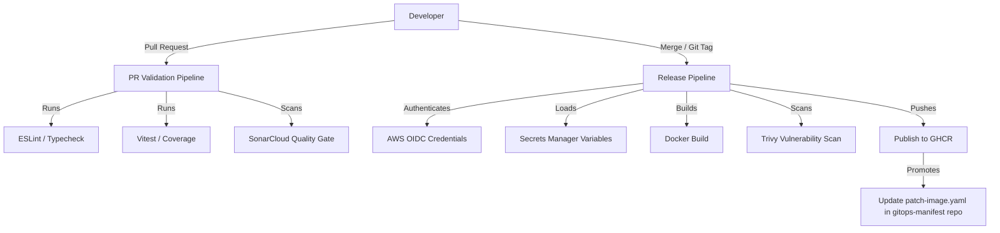

# 📱 TikTo

TikTo is a task & calendar planning application, structured as a monorepo with one web frontend (also acting as BFF) and five internal microservices.

> 🔗 Related repos: [gitops-manifest](https://github.com/flavoriy/gitops-manifest) (where new images get deployed) · [Infrastructure-as-Code](https://github.com/flavoriy/Infrastructure-as-Code) (the underlying EKS infrastructure)

---

## 🏗️ Architecture & Services

| Service | Role |
|---|---|
| `apps/web` | Next.js 16 (App Router) — UI + Backend-for-Frontend (BFF) proxy |
| `services/gateway` | API Gateway (Express) — rate-limiting, internal route proxying, health aggregation |
| `services/profile` | Profile domain service (Prisma + Supabase Postgres) |
| `services/tasks` | Task management domain service (Prisma + Supabase Postgres) |
| `services/calendar` | Calendar event domain service (Prisma + Supabase Postgres) |
| `services/dashboard` | Composition service — aggregates data from profile/tasks/calendar |

---

## 🔄 CI/CD Workflow



### 1. PR Validation

Every pull request triggers:
- **Linting & Typechecking**: `npm run lint` & `npm run typecheck`
- **Unit Testing**: Vitest with coverage reports
- **Code Quality**: SonarCloud Quality Gate analysis

### 2. Container Delivery & Security

On a merge or new tag (e.g. `v2.0.15`):
- Build a Docker image using an optimized **base Dockerfile** pattern to save build time.
- **Trivy** scans for HIGH and CRITICAL vulnerabilities — fails the pipeline if found.
- Publish the image to **GHCR** with environment-specific tags.

### 3. GitOps Automation

Once the image is pushed, the CD pipeline automatically commits the new tag to `patch-image.yaml` in the `gitops-manifest` repo, triggering Argo CD deployment — **this repo never deploys directly to the cluster**.

---

## 🛠️ Local Development

### Install dependencies

```bash
npm install
```

### Build internal microservices & generate Prisma client

```bash
npm run services:build
```

### Run the dev server

```bash
npm run dev                              # Next.js Web
npm run service:gateway:start            # API Gateway
npm run service:profile:start            # Profile Service
npm run service:tasks:start              # Tasks Service
npm run service:calendar:start           # Calendar Service
npm run service:dashboard:start          # Dashboard Service
```

---

## 🔍 Troubleshooting

### ❌ Connection Refused on internal Gateway calls

- **Issue**: pods calling the API Gateway via `http://tikto-gateway:4000` get `Connection Refused` during active rollouts.
- **Cause**: Argo Rollouts dynamically shifts the selector of the `tikto-gateway` service to move traffic; without an Istio sidecar, the pod can't resolve the shifting backend.
- **Fix**: point directly at the dedicated stable endpoint instead of the service currently being rolled out:

```
TIKTO_GATEWAY_API_URL=http://tikto-gateway-stable:4000
```

---

## 🧱 Tech stack

`Next.js 16` `TypeScript` `Express` `Prisma` `Supabase Postgres` `Vitest` `SonarCloud` `Docker` `Trivy` `GHCR` `GitHub Actions`
